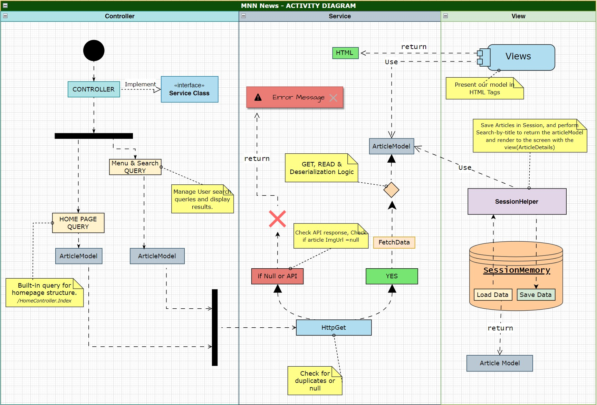
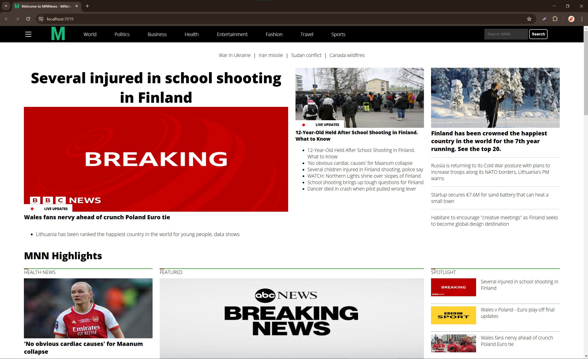

# MNN - Modern News Network Viewer

## Project Description
Hey there! MNN (Modern News Network Viewer) is an ASP.NET MVC application that pulls news articles from the NewsOrg API(newsapi.org). It's designed to look a bit like CNN, making it super easy and enjoyable to navigate. We use ViewComponents to manage UI components effectively and to filter content, which makes your experience smooth and straightforward.

## Key Features
- **Dynamic News Display**: Grabs articles dynamically using HTTP GET requests from newsapi.org.
- **CNN-inspired UI**: The interface feels a lot like browsing CNN, which means it’s very user-friendly and easy to get around.
- **Efficient Filtering**: You can filter articles right from the UI, helping you quickly find the news that interests you the most.
- **Service Layer Architecture**: All the heavy lifting about data fetching and operations is done in the service layer, keeping things organized.
- **Modular ViewComponents**: We're all about clean and maintainable code, which is why we use ViewComponents. They help keep our codebase tidy and easy to manage.

## Configuration Details

To get the MNN app up and running, there are a few things you need to set up first. Here’s how you can get your environment ready:

### 1. Obtain an API Key
To start fetching articles, you'll need an API key from newsapi.org:

- Head over to newsapi.org website and sign up for an account.
- Once you're signed in, go to your dashboard and generate a new API key.

### 2. Securely Store Your API Key
Instead of hardcoding your API key in your source code, we recommend using the Visual Studio Secret Manager for a safer setup:

- **Using Secret Manager in Visual Studio:**
  - In Visual Studio, right-click on your project in Solution Explorer and choose “Manage User Secrets”.
  - This opens a `secrets.json` file. Add your API key in this format:
    ```json
    {
      "apiKey": "REPLACE_WITH_YOUR_KEY"
    }
    ```
  - The secret is now safely stored and can be accessed from your application without exposing it in your codebase.

### 3. Accessing the API Key in Your Application
To use the API key in your application, you dont need to write any code, the logic to pull it is within the application.

```csharp
//Here is a sample ViewComponent class that fetches your api key from secret file.
public class TopHeadlines : ViewComponent
{
    private readonly string _apiKey = configuration.GetValue<string>("apiKey");
}
```
## ScreenShots
### 01
.jpg "How to Run the Program")
### 02
.jpg "How to Run the Program")
### 03
.jpg "How to Run the Program")
### 04
.jpg "How to Run the Program")
### 05
.jpg "How to Run the Program")
### 06

